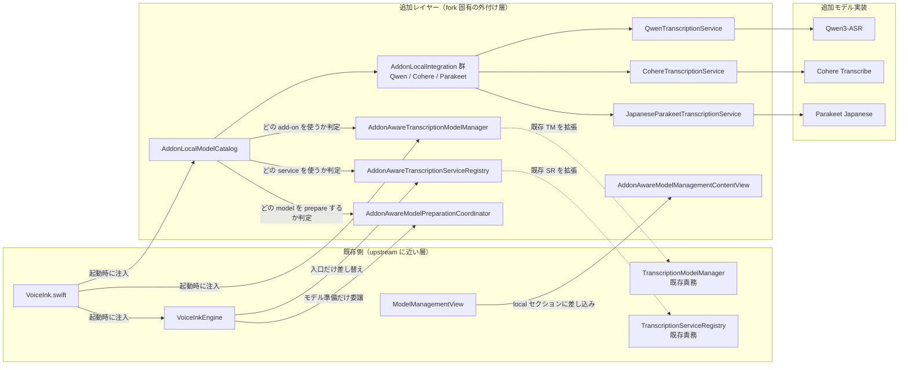

# Add-on Local Model Integration

`Qwen3-ASR`、`Cohere Transcribe`、`Parakeet Japanese` のような fork 固有モデルは、できるだけ既存実装の内側へ混ぜ込まず、追加レイヤーとして外付けする。

狙いは次の 3 つです。

1. fork 固有ロジックを既存 core から切り離す
2. upstream sync 時に衝突しやすい既存ファイルの差分を最小限にする
3. 今後 add-on モデルが増えても、追加先をほぼ add-on 層だけに限定する

## Overview

## How To Read

- 既存側で触るのは主に `VoiceInk.swift`、`VoiceInkEngine`、`ModelManagementView` のような入口だけ
- add-on 固有の判定、モデル一覧の統合、ダウンロード済み判定、準備処理、文字起こしサービス切り替えは `AddonAware*` と `AddonLocalModelCatalog` に寄せる
- `Qwen`、`Cohere`、`Parakeet` の個別実装は `Integration` と専用 service の下に閉じ込める

## Practical Rule

- 新しい add-on モデルを足すときは、まず `AddonLocalModelCatalog` と `AddonLocalIntegration` 側で完結できないかを優先する
- 既存の `TranscriptionModelManager` や `TranscriptionServiceRegistry` を直接広げるのは、add-on 層だけでは吸収できないときに限る
- 既存 UI への変更は、入口の差し込みにとどめる

## Local Build Usage

1. `make local` を実行する
2. 出力された `.app` を `Applications` フォルダへ入れる
3. 既存の `VoiceInk` があれば、そのまま上書きする

アクセシビリティや画面共有の権限設定がうまく反映されないことがある。

その場合は、macOS の権限設定から既存の `VoiceInk` を一度削除し、そのあと新しい `VoiceInk.app` を再度追加すると改善することがある。

## Current Limitation

upstream との差分を増やしすぎないことを優先しているため、add-on モデルでは prewarm と Power Mode 用の初期ロードにはまだ対応していない。

そのため、`Qwen3-ASR`、`Cohere Transcribe`、`Parakeet Japanese` を選んだ直後の最初の 1 回は、モデル準備のぶんだけ少し待ち時間が長くなる。

`Cohere Transcribe` だけは、`MLXAudioSTT` の公開 API がカスタム cache 注入をまだ受けていないため、保存先は VoiceInk の `Application Support` 配下ではなく Hugging Face の既定 cache 配下を使う。

2 回目以降は、同じ実行中セッション内でモデルが準備済みなら、最初の 1 回ほどの遅さは出にくい。
